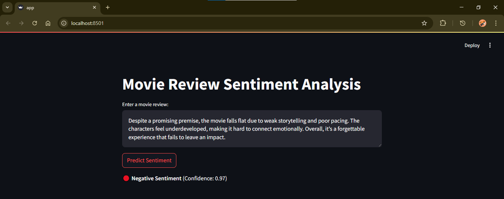

# 🎯 Sentiment Analysis using LSTM (IMDB Movie Reviews)

This project demonstrates a complete deep learning pipeline using LSTM for binary sentiment classification on movie reviews (Positive or Negative), with a Streamlit web interface.

---

## 📁 Dataset

- **Source**: [IMDB Dataset of 50K Movie Reviews](https://www.kaggle.com/datasets/lakshmi25npathi/imdb-dataset-of-50k-movie-reviews)
- **Structure**: 50,000+ rows, 2 columns (Review, Sentiment)

---

## 📌 Features

- **IMDB 50K Review Dataset**  
- **Custom Text Preprocessing** (Lowercasing, punctuation removal, stopword filtering)
- **Bidirectional LSTM Model** in Keras
- **Model Checkpointing + Early Stopping**
- **Tokenizer & Model Saved** for Inference
- **Real-time Prediction** script
- **Optional Streamlit Web Interface**

---

## 🗂️ Folder Structure

- **app.py**  
- **predict.py**
- **best_lstm_model.h5**
- **tokenizer.pkl**
- **Sentiment_Analysis_Using_LSTM.ipynb**
- **requirements.txt**
  
---  

## ⚙️ How to Run

### 🔧 Step 1: Install Required Packages

```bash
pip install -r requirements.txt
 ``` 

### 📁 Step 2: Run CLI Prediction Script(Optional)

```bash
python predict.py
```

### 🌐 Step 3: Launch Web App

```bash
streamlit run app.py
```
---

## 📊 Model Architecture
``` bash
Embedding Layer (128 units)
↓
Bidirectional LSTM (64 units)
↓
Dropout (0.3)
↓
LSTM (32 units)
↓
Dense (64 units, ReLU)
↓
Dropout (0.5)
↓
Dense (1 unit, Sigmoid)
```
---

## 🔁 Training Info

- **Dataset: IMDB Movie Reviews (50,000 samples)**
- **Split: 80% train / 20% validation**
- **Optimizer: Adam**
- **Loss: Binary Crossentropy**
- **Callbacks: ModelCheckpoint, EarlyStopping**
- **Batch Size: 64**
- **Epochs: Up to 20 (Early stopped)**

---

## 🧪 Sample Outputs

### Screenshots

#### 🖼️ Negative Sentiment Detection


#### 🖼️ Positive Sentiment Detection


---

#### ✍️ By Kavana B C 
##### Made with ❤️ for a hiring challenge.
